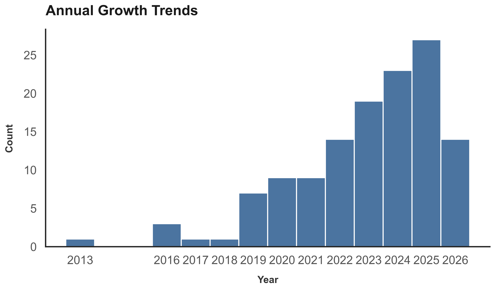

# Machine Learning for Thermoelectric Materials

A curated collection of research papers, datasets, and software tools at the intersection of machine learning and thermoelectric materials.

  

## Table of Contents

- [Research Papers](#research-papers)
- [Datasets & Databases](#datasets--databases)
- [Tools & Frameworks](#tools--frameworks)
- [Contributing](#contributing)

##  Research Papers

> [!TIP]
> **Review papers, mini-reviews, and perspectives** are indicated with a star (**★**).

| # | Title | Year |
| --- | --- | --- |
| 1 | [Machine learning discovery of medium-entropy thermoelectric materials with ultralow lattice thermal conductivity](https://doi.org/10.1039/d5ta09114d) | 2026 |
| 2 | [Interpretable machine learning for thermoelectric materials design with Kolmogorov–Arnold networks](https://doi.org/10.1038/s41598-026-44723-x) | 2026 |
| 3 | [Machine Learning Discovery of Record-Low Lattice Thermal Conductivity in Double Perovskites](https://doi.org/10.1002/advs.202515766) | 2026 |
| 4 | [Rational Design of Single-Phase High-Entropy Oxides via Large Language Model Data Mining and Explainable Machine Learning](https://doi.org/10.1021/acs.jcim.6c00752) | 2026 |
| 5 | [Bridging Machine Learning and Zintl Phase Thermoelectric Materials: The Ca9–xEuxZn4.5–yCuySb9 System](https://doi.org/10.1021/acs.chemmater.6c00656) | 2026 |
| 6 | [Fast and Accurate Prediction of Lattice Thermal Conductivity via Machine Learning Surrogates](https://doi.org/10.48550/arXiv.2605.11610) | 2026 Preprint |
| 7 | [Large Language Model-Assisted Discovery of Optimal Dopants for Enhanced Thermoelectric Performance in CoSb₃-Based Skutterudites](https://doi.org/10.48550/arXiv.2604.06048) | 2026 Preprint |
| 8 | [Artificial intelligence-driven approaches for materials design and discovery](https://doi.org/10.1038/s41563-025-02403-7) | 2026 |
| 9 | [Advances in Generative Models for Accelerated Discovery of New Materials](https://doi.org/10.1002/csc3.70010) | 2026 |
| 10 | [Artificial Intelligence for Multiscale Modeling in Solid-State Physics and Chemistry: A Comprehensive Review](https://doi.org/10.1002/aisy.202501219) ★ | 2026 |
| 11 | Machine learning-assisted 3D printing of thermoelectric materials of ultrahigh performances at room temperature | 2024 |
| 12 | Discovery of the layered thermoelectric compound GeBi2Se4 and accelerating its performance optimization by machine learning | 2024 |
| 13 | Determination of electrical and thermal conductivities of n-and p-type thermoelectric materials by prediction iteration machine learning method | 2024 |
| 14 | Machine learning for next-generation thermoelectrics ★ | 2024 |
| 15 | [Machine Learning Predictions of Thermopower for Thermoelectric Material Screening](https://doi.org/10.1021/acsaem.5c02609) | 2025 |
| 16 | [Thermoelectric Properties in Skutterudite Materials: Integrating Experimental Data, Density Functional Theory, and Machine Learning](https://doi.org/10.1021/acsaem.5c00445) | 2025 |
| 17 | [Thermoelectric Material Performance (zT) Predictions with Machine Learning](https://doi.org/10.1021/acsami.4c19149) | 2025 |
| 18 | [AI-Driven Defect Engineering for Advanced Thermoelectric Materials](https://doi.org/10.1002/adma.202505642) | 2025 |
| 19 | [Active Learning-Guided Accelerated Discovery of Ultra-Efficient High-Entropy Thermoelectrics](https://doi.org/10.1002/adma.202515054) | 2025 |
| 20 | [Machine learning for accelerated prediction of lattice thermal conductivity at arbitrary temperature](https://doi.org/10.1039/d4dd00286e) | 2025 |
| 21 | [Exploiting chemical bonding principles to design high-performance thermoelectric materials](https://doi.org/10.1038/s41570-025-00695-6) | 2025 |
| 22 | [Human-Machine Collaborative Design of SnTe-Based Thermoelectric Materials via a Multiagent Framework Leveraging Large Language Models](https://doi.org/10.1021/acsami.5c16158) | 2025 |
| 23 | [Recent strides in artificial intelligence for predicting thermoelectric properties and materials discovery](https://doi.org/10.1088/2515-7655/adba87) ★ | 2025 |
| 24 | [Leveraging Machine Learning for Thermoelectric Material Design: Addressing Composition−Property Relations and Data Imbalance Challenges](https://doi.org/10.1021/acsaem.5c02885) | 2025 |
| 25 | [Data-driven exploration of Na–Bi compounds: a first-principles and machine learning approach to topological thermoelectrics](https://doi.org/10.1039/d5ra05888k) | 2025 |
| 26 | [Unlocking Thermoelectric Potential: A Machine Learning Stacking Approach for Half-Heusler Alloys](https://doi.org/10.1021/acsaem.5c02223) | 2025 |
| 27 | [Large Language Models (LLMs) for Materials Design](https://doi.org/10.1002/adfm.202525897) | 2025 |
| 28 | [Deep learning methods for 2D material electronic properties](https://doi.org/10.1039/d5dd00155b) | 2025 |
| 29 | [Classification-Based Detection and Quantification of Cross-Domain Data Bias in Materials Discovery](https://doi.org/10.1021/acs.jcim.4c01766) | 2025 |
| 30 | [PSCG-Net: A Multiscale Crystal Graph Neural Network for Accelerated Materials Discovery](https://doi.org/10.1021/acs.jcim.5c01460) | 2025 |
| 31 | [Leveraging generative models with periodicity-aware, invertible and invariant representations for crystalline materials design](https://doi.org/10.1038/s43588-025-00797-7) | 2025 |
| 32 | [Interpretable Machine Learning Model on Thermal Conductivity Using Publicly Available Datasets and Our Internal Lab Dataset](https://doi.org/10.1021/acs.chemmater.4c01696) | 2024 |
| 33 | [Machine learning based feature engineering for thermoelectric materials by design](https://doi.org/10.1039/d3dd00131h) | 2024 |
| 34 | [Machine Learning-Driven Inverse Design and Role of Dopant for Tuning Thermoelectric Efficiency](https://doi.org/10.1021/acsaelm.4c00808) | 2024 |
| 35 | [Leveraging language representation for materials exploration and discovery](https://doi.org/10.1038/s41524-024-01231-8) | 2024 |
| 36 | [Predicting lattice thermal conductivity via machine learning: a mini review](https://doi.org/10.1038/s41524-023-00964-2) ★ | 2023 |
| 37 | [Artificial Intelligence Guided Thermoelectric Materials Design and Discovery](https://doi.org/10.1002/aelm.202300042) | 2023 |
| 38 | [Interpretable Machine Learning Workflow for Evaluating and Analyzing the Performance of High-Entropy GeTe-Based Thermoelectric Materials](https://doi.org/10.1021/acsaelm.3c00692) | 2023 |
| 39 | [Machine learning for predicting ZT values of high-performance thermoelectric materials in mid-temperature range](https://doi.org/10.1063/5.0160055) | 2023 |
| 40 | [High-throughput computational discovery of 3218 ultralow thermal conductivity and dynamically stable materials by dual machine learning models](https://doi.org/10.1039/d3ta04874h) | 2023 |
| 41 | [Experimentally validated machine learning predictions of ultralow thermal conductivity for SnSe materials](https://doi.org/10.1039/d3tc01450a) | 2023 |
| 42 | [In Pursuit of the Exceptional: Research Directions for Machine Learning in Chemical and Materials Science](https://doi.org/10.1021/jacs.3c04783) ★ | 2023 |
| 43 | [A critical review of machine learning techniques on thermoelectric materials](https://www.google.com/search?q=https://doi.org/10.1021/acs.jpclett.3c00180) ★ | 2023 |
| 44 | Hybrid data-driven discovery of high-performance silver selenide-based thermoelectric composites | 2023 |
| 45 | Ensemble learning-based investigation of thermal conductivity of Bi2Te2.7Se0.3-based thermoelectric clean energy materials | 2023 |
| 46 | Knowledge extraction and performance improvement of Bi2Te3-based thermoelectric materials by machine learning | 2023 |
| 47 | Prediction of lattice thermal conductivity with two-stage interpretable machine learning | 2023 |
| 48 | A machine learning methodology to investigate the lattice thermal conductivity of defected PbTe | 2023 |
| 49 | Prediction of superior thermoelectric performance in unexplored doped-BiCuSeO via machine learning | 2023 |
| 50 | [Data-Driven Enhancement of ZT in SnSe-Based Thermoelectric Systems](https://doi.org/10.1021/jacs.2c04741) | 2022 |
| 51 | [Large Data Set-Driven Machine Learning Models for Accurate Prediction of the Thermoelectric Figure of Merit](https://doi.org/10.1021/acsami.2c15396) | 2022 |
| 52 | [Recent advances and applications of deep learning methods in materials science](https://doi.org/10.1038/s41524-022-00734-6) | 2022 |
| 53 | [Machine learning approaches for accelerating the discovery of thermoelectric materials](https://www.google.com/search?q=https://doi.org/10.1016/j.mattod.2022.01.010) | 2022 |
| 54 | Machine learning assisted discovering of new M2X3-type thermoelectric materials | 2022 |
| 55 | Machine learning-assisted ultrafast flash sintering of high-performance and flexible silver-selenide thermoelectric devices | 2022 |
| 56 | Lattice thermal conductivity of half-Heuslers with density functional theory and machine learning: enhancing predictivity by active sampling with principal component analysis | 2022 |
| 57 | Predicting the thermal conductivity of Bi2Te3-based thermoelectric energy materials: a machine learning approach | 2022 |
| 58 | A deep learning perspective into the figure-of-merit of thermoelectric materials | 2022 |
| 59 | Accurate and explainable machine learning for the power factors of diamond-like thermoelectric materials | 2022 |
| 60 | Predicting thermoelectric transport properties from composition with attention-based deep learning | 2022 |
| 61 | [Compositionally restricted attention-based network for materials property predictions](https://doi.org/10.1038/s41524-021-00545-1) | 2021 |
| 62 | [Atomistic Line Graph Neural Network for improved materials property predictions](https://doi.org/10.1038/s41524-021-00650-1) | 2021 |
| 63 | [Lattice Thermal Conductivity: An Accelerated Discovery Guided by Machine Learning](https://doi.org/10.1021/acsami.1c17378) | 2021 |
| 64 | [Predicting thermoelectric properties from chemical formula with explicitly identifying dopant effects](https://doi.org/10.1038/s41524-021-00564-y) | 2021 |
| 65 | [Determining usefulness of machine learning in materials discovery using simulated research landscapes](https://doi.org/10.1039/d1cp01761f) | 2021 |
| 66 | [Cross-property deep transfer learning framework for enhanced predictive analytics on small materials data](https://doi.org/10.1038/s41467-021-26921-5) | 2021 |
| 67 | Materials discovery and properties prediction in thermal transport via materials informatics: A mini review ★ | 2019 |
| 68 | Data-driven thermoelectric modeling: Current challenges and prospects ★ | 2021 |
| 69 | Machine learning approach for the prediction and optimization of thermal transport properties | 2021 |
| 70 | FeeAleSi thermoelectric (FAST) materials and modules: diffusion couple and machine-learning-assisted materials development | 2021 |
| 71 | [The Role of Machine Learning in the Understanding and Design of Materials](https://dx.doi.org/10.1021/jacs.0c09105) ★ | 2020 |
| 72 | [Property-Oriented Material Design Based on a Data-Driven Machine Learning Technique](https://dx.doi.org/10.1021/acs.jpclett.0c00665) ★ | 2020 |
| 73 | [Simulation and design of energy materials accelerated by machine learning](https://doi.org/10.1002/wcms.1421) ★ | 2020 |
| 74 | Machine learning chemical guidelines for engineering electronic structures in half-Heusler thermoelectric materials | 2020 |
| 75 | Machine learning approaches to identify and design low thermal conductivity oxides for thermoelectric applications | 2020 |
| 76 | Ensemble-machine-learning-based correlation analysis of internal and band characteristics of thermoelectric materials | 2020 |
| 77 | Processing optimization and property predictions of hot-extruded Bi-Te-Se thermoelectric materials via machine learning | 2020 |
| 78 | [Data-driven analysis of electron relaxation times in PbTe-type thermoelectric materials](https://doi.org/10.1080/14686996.2019.1603885) | 2019 |
| 79 | [Coupling High-throughput Property Map to Machine Learning for Predicting Lattice Thermal Conductivity](https://doi.org/10.1021/acs.chemmater.9b01046) | 2019 |
| 80 | [Machine Learning Interatomic Potentials as Emerging Tools for Materials Science](https://doi.org/10.1002/adma.201902765) | 2019 |
| 81 | Machine-learning guided discovery of a new thermoelectric material | 2019 |
| 82 | [Prediction of Seebeck Coefficient for Compounds without Restriction to Fixed Stoichiometry: A Machine Learning Approach](https://doi.org/10.1002/jcc.25067) | 2017 |
| 83 | [Perspective: Web-based machine learning models for real-time screening of thermoelectric materials properties](https://doi.org/10.1063/1.4952607) ★ | 2016 |

## Datasets & Databases
Curated collections of thermoelectric property data for model training and benchmarking.

| # | Title | Year |
|:-:|-------|------|
|1|[Database and deep-learning scalability of anharmonic phonon properties by automated brute-force first-principles calculations](https://doi.org/10.1038/s41524-026-02033-w)|2026
|2|[Large language model-driven database for thermoelectric materials](https://doi.org/10.1016/j.commatsci.2025.113855)|2025
|3|[Wenzhou TE: A First-Principle-Calculated Thermoelectric Materials Database](https://doi.org/10.3390/ma17102200)|2024
|4|[TEXplorer.org: Thermoelectric material properties data platform for experimental and first-principles calculation results](https://doi.org/10.1063/5.0137642)|2023
|5|[Sustainable Thermoelectric Materials Predicted by Machine Learning](https://doi.org/10.1002/adts.202200351)|2022
|6|[A public database of thermoelectric materials and system-identified material representation for data-driven discovery](https://doi.org/10.1038/s41524-022-00897-2)|2022
|7|[Data-Driven Review of Thermoelectric Materials: Performance and Resource Considerations](https://dx.doi.org/10.1021/cm400893e)|2013

## Tools & Frameworks
Software libraries, featurization tools, and ML frameworks for materials informatics.

| # | Title | Year |
|:-:|-------|------|
|1|[Machine Learning Toolkits and Frameworks for Materials Design](https://doi.org/10.1002/wcms.70067)|2026
|2|[Composition and structure analyzer/featurizer for explainable machine-learning models to predict solid state structures](https://doi.org/10.1039/d4dd00332b)|2025
|3|[Matini-Net: Versatile Material Informatics Research Framework for Feature Engineering and Deep Neural Network Design](https://doi.org/10.1021/acs.jcim.4c01676)|2024
|4|[ChemML: A machine learning and informatics program package for the analysis, mining, and modeling of chemical and materials data](https://doi.org/10.1002/wcms.1458)|2020
|5|[Matminer: An open source toolkit for materials data mining](https://doi.org/10.1016/j.commatsci.2018.05.018)|2018
|6|[TE Design Lab: A virtual laboratory for thermoelectric material design](http://dx.doi.org/10.1016/j.commatsci.2015.11.006)|2016
